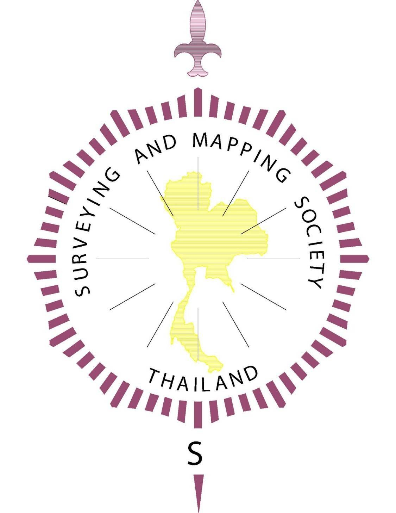

<table width="100%">
  <tr>
    <td align="center" width="50%"></td>
    <td align="center" width="50%"></td>
  </tr>
</table>

# Thailand Low Distortion Map Coordinate System (TH-LDP)

### **Release Candidate 1 (RC-1, Aug 2026)**

*A collaborative initiative by **SMST** & **APAC***

---

## Provincial LDP: Aggregate Population Coverage Within the ±20 ppm Limit

*(Table is sorted by population coverage. Performance indicators: 🟢 80-100%, 🟡 70-80%, 🔴 <70%)*

| ISO_1   | HASC_1   | NAME_1                   | POP_Coverage(%)                                                                                                                         |   Samples | LDP   | CM_CP   |   area_sqkm |   EW_km |   NS_km |
|---------|----------|--------------------------|-----------------------------------------------------------------------------------------------------------------------------------------|-----------|-------|---------|-------------|---------|---------|
| TH-15   | TH.AT    | Ang Thong                | <a href='https://github.com/phisan-chula/2026-EIT_TH_LDP/blob/main/src/OUTPUT_LDP/TH_AT/TH_AT_OnePage.pdf' target='_blank'>🟢 98.39</a> |       952 | TM    | 100:21  |         982 |      34 |      40 |
| TH-37   | TH.AC    | Amnat Charoen            | <a href='https://github.com/phisan-chula/2026-EIT_TH_LDP/blob/main/src/OUTPUT_LDP/TH_AC/TH_AC_OnePage.pdf' target='_blank'>🟢 97.9</a>  |      3236 | TM    | 104:45  |        3371 |      68 |      82 |
| TH-36   | TH.CY    | Chaiyaphum               | <a href='https://github.com/phisan-chula/2026-EIT_TH_LDP/blob/main/src/OUTPUT_LDP/TH_CY/TH_CY_OnePage.pdf' target='_blank'>nan</a>      |       nan | TM    | 101:49  |       13177 |     121 |     157 |
| TH-55   | TH.NA    | Nan                      | <a href='https://github.com/phisan-chula/2026-EIT_TH_LDP/blob/main/src/OUTPUT_LDP/TH_NA/TH_NA_OnePage.pdf' target='_blank'>nan</a>      |       nan | TM    | 100:50  |       12923 |     107 |     179 |
| TH-67   | TH.PH    | Phetchabun               | <a href='https://github.com/phisan-chula/2026-EIT_TH_LDP/blob/main/src/OUTPUT_LDP/TH_PH/TH_PH_OnePage.pdf' target='_blank'>nan</a>      |       nan | TM    | 101:09  |       12907 |     122 |     201 |
| TH-57   | TH.CR    | Chiang Rai               | <a href='https://github.com/phisan-chula/2026-EIT_TH_LDP/blob/main/src/OUTPUT_LDP/TH_CR/TH_CR_OnePage.pdf' target='_blank'>nan</a>      |       nan | TM    | 99:52   |       12299 |     137 |     162 |
| TH-41   | TH.UN    | Udon Thani               | <a href='https://github.com/phisan-chula/2026-EIT_TH_LDP/blob/main/src/OUTPUT_LDP/TH_UN/TH_UN_OnePage.pdf' target='_blank'>nan</a>      |       nan | LCC   | 17:25   |       11588 |     174 |     142 |
| TH-40   | TH.KK    | Khon Kaen                | <a href='https://github.com/phisan-chula/2026-EIT_TH_LDP/blob/main/src/OUTPUT_LDP/TH_KK/TH_KK_OnePage.pdf' target='_blank'>nan</a>      |       nan | TM    | 102:35  |       11050 |     153 |     161 |
| TH-42   | TH.LE    | Loei                     | <a href='https://github.com/phisan-chula/2026-EIT_TH_LDP/blob/main/src/OUTPUT_LDP/TH_LE/TH_LE_OnePage.pdf' target='_blank'>nan</a>      |       nan | TM    | 101:38  |       11033 |     139 |     162 |
| TH-31   | TH.BR    | Buri Ram                 | <a href='https://github.com/phisan-chula/2026-EIT_TH_LDP/blob/main/src/OUTPUT_LDP/TH_BR/TH_BR_OnePage.pdf' target='_blank'>nan</a>      |       nan | TM    | 102:58  |       10410 |     115 |     184 |
| TH-80   | TH.NT    | Nakhon Si Thammarat      | <a href='https://github.com/phisan-chula/2026-EIT_TH_LDP/blob/main/src/OUTPUT_LDP/TH_NT/TH_NT_OnePage.pdf' target='_blank'>nan</a>      |       nan | TM    | 99:47   |       10019 |     120 |     165 |
| TH-47   | TH.SN    | Sakon Nakhon             | <a href='https://github.com/phisan-chula/2026-EIT_TH_LDP/blob/main/src/OUTPUT_LDP/TH_SN/TH_SN_OnePage.pdf' target='_blank'>nan</a>      |       nan | TM    | 103:50  |        9985 |     125 |     146 |
| TH-60   | TH.NS    | Nakhon Sawan             | <a href='https://github.com/phisan-chula/2026-EIT_TH_LDP/blob/main/src/OUTPUT_LDP/TH_NS/TH_NS_OnePage.pdf' target='_blank'>nan</a>      |       nan | LCC   | 15:41   |        9875 |     188 |     126 |
| TH-33   | TH.SI    | Si Sa Ket                | <a href='https://github.com/phisan-chula/2026-EIT_TH_LDP/blob/main/src/OUTPUT_LDP/TH_SI/TH_SI_OnePage.pdf' target='_blank'>nan</a>      |       nan | TM    | 104:22  |        9157 |     107 |     135 |
| TH-32   | TH.SU    | Surin                    | <a href='https://github.com/phisan-chula/2026-EIT_TH_LDP/blob/main/src/OUTPUT_LDP/TH_SU/TH_SU_OnePage.pdf' target='_blank'>nan</a>      |       nan | TM    | 103:40  |        9079 |     107 |     127 |
| TH-62   | TH.KP    | Kamphaeng Phet           | <a href='https://github.com/phisan-chula/2026-EIT_TH_LDP/blob/main/src/OUTPUT_LDP/TH_KP/TH_KP_OnePage.pdf' target='_blank'>nan</a>      |       nan | TM    | 99:32   |        8996 |     113 |     116 |
| TH-45   | TH.RE    | Roi Et                   | <a href='https://github.com/phisan-chula/2026-EIT_TH_LDP/blob/main/src/OUTPUT_LDP/TH_RE/TH_RE_OnePage.pdf' target='_blank'>nan</a>      |       nan | TM    | 103:49  |        8117 |     115 |     118 |
| TH-90   | TH.SG    | Songkhla                 | <a href='https://github.com/phisan-chula/2026-EIT_TH_LDP/blob/main/src/OUTPUT_LDP/TH_SG/TH_SG_OnePage.pdf' target='_blank'>nan</a>      |       nan | TM    | 100:33  |        7669 |     116 |     182 |
| TH-46   | TH.KL    | Kalasin                  | <a href='https://github.com/phisan-chula/2026-EIT_TH_LDP/blob/main/src/OUTPUT_LDP/TH_KL/TH_KL_OnePage.pdf' target='_blank'>nan</a>      |       nan | LCC   | 16:38   |        7200 |     121 |     102 |
| TH-27   | TH.SK    | Sa Kaeo                  | <a href='https://github.com/phisan-chula/2026-EIT_TH_LDP/blob/main/src/OUTPUT_LDP/TH_SK/TH_SK_OnePage.pdf' target='_blank'>nan</a>      |       nan | TM    | 102:19  |        7063 |     116 |     106 |
| TH-64   | TH.SO    | Sukhothai                | <a href='https://github.com/phisan-chula/2026-EIT_TH_LDP/blob/main/src/OUTPUT_LDP/TH_SO/TH_SO_OnePage.pdf' target='_blank'>nan</a>      |       nan | TM    | 99:43   |        7014 |      84 |     126 |
| TH-61   | TH.UT    | Uthai Thani              | <a href='https://github.com/phisan-chula/2026-EIT_TH_LDP/blob/main/src/OUTPUT_LDP/TH_UT/TH_UT_OnePage.pdf' target='_blank'>nan</a>      |       nan | LCC   | 15:21   |        6907 |     120 |      95 |
| TH-54   | TH.PR    | Phrae                    | <a href='https://github.com/phisan-chula/2026-EIT_TH_LDP/blob/main/src/OUTPUT_LDP/TH_PR/TH_PR_OnePage.pdf' target='_blank'>nan</a>      |       nan | TM    | 100:04  |        6815 |     124 |     125 |
| TH-77   | TH.PK    | Prachuap Khiri Khan      | <a href='https://github.com/phisan-chula/2026-EIT_TH_LDP/blob/main/src/OUTPUT_LDP/TH_PK/TH_PK_OnePage.pdf' target='_blank'>nan</a>      |       nan | TM    | 99:38   |        6555 |      94 |     188 |
| TH-16   | TH.LB    | Lop Buri                 | <a href='https://github.com/phisan-chula/2026-EIT_TH_LDP/blob/main/src/OUTPUT_LDP/TH_LB/TH_LB_OnePage.pdf' target='_blank'>nan</a>      |       nan | TM    | 100:54  |        6477 |     106 |     102 |
| TH-56   | TH.PY    | Phayao                   | <a href='https://github.com/phisan-chula/2026-EIT_TH_LDP/blob/main/src/OUTPUT_LDP/TH_PY/TH_PY_OnePage.pdf' target='_blank'>nan</a>      |       nan | TM    | 100:11  |        6473 |     101 |     103 |
| TH-22   | TH.CT    | Chanthaburi              | <a href='https://github.com/phisan-chula/2026-EIT_TH_LDP/blob/main/src/OUTPUT_LDP/TH_CT/TH_CT_OnePage.pdf' target='_blank'>nan</a>      |       nan | TM    | 102:08  |        6412 |      91 |     114 |
| TH-76   | TH.PE    | Phetchaburi              | <a href='https://github.com/phisan-chula/2026-EIT_TH_LDP/blob/main/src/OUTPUT_LDP/TH_PE/TH_PE_OnePage.pdf' target='_blank'>nan</a>      |       nan | LCC   | 12:57   |        6340 |     108 |      89 |
| TH-86   | TH.CP    | Chumphon                 | <a href='https://github.com/phisan-chula/2026-EIT_TH_LDP/blob/main/src/OUTPUT_LDP/TH_CP/TH_CP_OnePage.pdf' target='_blank'>nan</a>      |       nan | TM    | 99:04   |        6095 |      97 |     158 |
| TH-44   | TH.MS    | Maha Sarakham            | <a href='https://github.com/phisan-chula/2026-EIT_TH_LDP/blob/main/src/OUTPUT_LDP/TH_MS/TH_MS_OnePage.pdf' target='_blank'>nan</a>      |       nan | TM    | 103:10  |        5827 |      70 |     137 |
| TH-48   | TH.NF    | Nakhon Phanom            | <a href='https://github.com/phisan-chula/2026-EIT_TH_LDP/blob/main/src/OUTPUT_LDP/TH_NF/TH_NF_OnePage.pdf' target='_blank'>nan</a>      |       nan | TM    | 104:26  |        5714 |      87 |     137 |
| TH-72   | TH.SH    | Suphan Buri              | <a href='https://github.com/phisan-chula/2026-EIT_TH_LDP/blob/main/src/OUTPUT_LDP/TH_SH/TH_SH_OnePage.pdf' target='_blank'>nan</a>      |       nan | TM    | 99:54   |        5599 |     107 |     113 |
| TH-24   | TH.CC    | Chachoengsao             | <a href='https://github.com/phisan-chula/2026-EIT_TH_LDP/blob/main/src/OUTPUT_LDP/TH_CC/TH_CC_OnePage.pdf' target='_blank'>nan</a>      |       nan | LCC   | 13:36   |        5372 |     123 |      88 |
| TH-70   | TH.RT    | Ratchaburi               | <a href='https://github.com/phisan-chula/2026-EIT_TH_LDP/blob/main/src/OUTPUT_LDP/TH_RT/TH_RT_OnePage.pdf' target='_blank'>nan</a>      |       nan | TM    | 99:35   |        5326 |      97 |      88 |
| TH-25   | TH.PB    | Prachin Buri             | <a href='https://github.com/phisan-chula/2026-EIT_TH_LDP/blob/main/src/OUTPUT_LDP/TH_PB/TH_PB_OnePage.pdf' target='_blank'>nan</a>      |       nan | TM    | 101:39  |        5148 |     104 |      97 |
| TH-92   | TH.TG    | Trang                    | <a href='https://github.com/phisan-chula/2026-EIT_TH_LDP/blob/main/src/OUTPUT_LDP/TH_TG/TH_TG_OnePage.pdf' target='_blank'>nan</a>      |       nan | TM    | 99:36   |        4812 |      84 |     104 |
| TH-51   | TH.LN    | Lamphun                  | <a href='https://github.com/phisan-chula/2026-EIT_TH_LDP/blob/main/src/OUTPUT_LDP/TH_LN/TH_LN_OnePage.pdf' target='_blank'>nan</a>      |       nan | TM    | 98:57   |        4721 |      69 |     142 |
| TH-20   | TH.CB    | Chon Buri                | <a href='https://github.com/phisan-chula/2026-EIT_TH_LDP/blob/main/src/OUTPUT_LDP/TH_CB/TH_CB_OnePage.pdf' target='_blank'>nan</a>      |       nan | TM    | 101:12  |        4550 |      95 |     111 |
| TH-66   | TH.PC    | Phichit                  | <a href='https://github.com/phisan-chula/2026-EIT_TH_LDP/blob/main/src/OUTPUT_LDP/TH_PC/TH_PC_OnePage.pdf' target='_blank'>nan</a>      |       nan | TM    | 100:21  |        4495 |      83 |      81 |
| TH-96   | TH.NW    | Narathiwat               | <a href='https://github.com/phisan-chula/2026-EIT_TH_LDP/blob/main/src/OUTPUT_LDP/TH_NW/TH_NW_OnePage.pdf' target='_blank'>nan</a>      |       nan | TM    | 101:43  |        4486 |      79 |      99 |
| TH-81   | TH.KR    | Krabi                    | <a href='https://github.com/phisan-chula/2026-EIT_TH_LDP/blob/main/src/OUTPUT_LDP/TH_KR/TH_KR_OnePage.pdf' target='_blank'>nan</a>      |       nan | TM    | 99:01   |        4483 |      87 |     112 |
| TH-95   | TH.YL    | Yala                     | <a href='https://github.com/phisan-chula/2026-EIT_TH_LDP/blob/main/src/OUTPUT_LDP/TH_YL/TH_YL_OnePage.pdf' target='_blank'>nan</a>      |       nan | TM    | 101:14  |        4461 |      85 |     118 |
| TH-39   | TH.NB    | Nong Bua Lam Phu         | <a href='https://github.com/phisan-chula/2026-EIT_TH_LDP/blob/main/src/OUTPUT_LDP/TH_NB/TH_NB_OnePage.pdf' target='_blank'>nan</a>      |       nan | TM    | 102:18  |        4322 |      74 |     101 |
| TH-35   | TH.YS    | Yasothon                 | <a href='https://github.com/phisan-chula/2026-EIT_TH_LDP/blob/main/src/OUTPUT_LDP/TH_YS/TH_YS_OnePage.pdf' target='_blank'>nan</a>      |       nan | TM    | 104:21  |        4257 |      88 |     117 |
| TH-38   | TH.BK    | Bueng Kan                | <a href='https://github.com/phisan-chula/2026-EIT_TH_LDP/blob/main/src/OUTPUT_LDP/TH_BK/TH_BK_OnePage.pdf' target='_blank'>nan</a>      |       nan | LCC   | 18:09   |        4204 |      99 |      75 |
| TH-93   | TH.PL    | Phatthalung              | <a href='https://github.com/phisan-chula/2026-EIT_TH_LDP/blob/main/src/OUTPUT_LDP/TH_PL/TH_PL_OnePage.pdf' target='_blank'>nan</a>      |       nan | TM    | 100:04  |        3854 |      76 |      89 |
| TH-21   | TH.RY    | Rayong                   | <a href='https://github.com/phisan-chula/2026-EIT_TH_LDP/blob/main/src/OUTPUT_LDP/TH_RY/TH_RY_OnePage.pdf' target='_blank'>nan</a>      |       nan | LCC   | 12:51   |        3788 |      91 |      64 |
| TH-19   | TH.SR    | Saraburi                 | <a href='https://github.com/phisan-chula/2026-EIT_TH_LDP/blob/main/src/OUTPUT_LDP/TH_SR/TH_SR_OnePage.pdf' target='_blank'>nan</a>      |       nan | TM    | 101:01  |        3683 |      94 |      89 |
| TH-82   | TH.PG    | Phangnga                 | <a href='https://github.com/phisan-chula/2026-EIT_TH_LDP/blob/main/src/OUTPUT_LDP/TH_PG/TH_PG_OnePage.pdf' target='_blank'>nan</a>      |       nan | TM    | 98:25   |        3667 |      55 |     135 |
| TH-43   | TH.NK    | Nong Khai                | <a href='https://github.com/phisan-chula/2026-EIT_TH_LDP/blob/main/src/OUTPUT_LDP/TH_NK/TH_NK_OnePage.pdf' target='_blank'>nan</a>      |       nan | LCC   | 17:56   |        3383 |     143 |      78 |
| TH-999  | TH.GBKK  | GreaterBKK               | <a href='https://github.com/phisan-chula/2026-EIT_TH_LDP/blob/main/src/OUTPUT_LDP/TH_GBKK/TH_GBKK_OnePage.pdf' target='_blank'>nan</a>  |       nan | TM    | 100:36  |        3232 |      75 |      73 |
| TH-85   | TH.RN    | Ranong                   | <a href='https://github.com/phisan-chula/2026-EIT_TH_LDP/blob/main/src/OUTPUT_LDP/TH_RN/TH_RN_OnePage.pdf' target='_blank'>nan</a>      |       nan | TM    | 98:42   |        3112 |      62 |     164 |
| TH-14   | TH.PA    | Phra Nakhon Si Ayutthaya | <a href='https://github.com/phisan-chula/2026-EIT_TH_LDP/blob/main/src/OUTPUT_LDP/TH_PA/TH_PA_OnePage.pdf' target='_blank'>nan</a>      |       nan | TM    | 100:32  |        2629 |      62 |      62 |
| TH-23   | TH.TT    | Trat                     | <a href='https://github.com/phisan-chula/2026-EIT_TH_LDP/blob/main/src/OUTPUT_LDP/TH_TT/TH_TT_OnePage.pdf' target='_blank'>nan</a>      |       nan | TM    | 102:32  |        2555 |      71 |     122 |
| TH-18   | TH.CN    | Chai Nat                 | <a href='https://github.com/phisan-chula/2026-EIT_TH_LDP/blob/main/src/OUTPUT_LDP/TH_CN/TH_CN_OnePage.pdf' target='_blank'>nan</a>      |       nan | LCC   | 15:08   |        2554 |      68 |      57 |
| TH-91   | TH.SA    | Satun                    | <a href='https://github.com/phisan-chula/2026-EIT_TH_LDP/blob/main/src/OUTPUT_LDP/TH_SA/TH_SA_OnePage.pdf' target='_blank'>nan</a>      |       nan | TM    | 99:58   |        2460 |      60 |      80 |
| TH-73   | TH.NP    | Nakhon Pathom            | <a href='https://github.com/phisan-chula/2026-EIT_TH_LDP/blob/main/src/OUTPUT_LDP/TH_NP/TH_NP_OnePage.pdf' target='_blank'>nan</a>      |       nan | TM    | 100:06  |        2211 |      54 |      62 |
| TH-26   | TH.NN    | Nakhon Nayok             | <a href='https://github.com/phisan-chula/2026-EIT_TH_LDP/blob/main/src/OUTPUT_LDP/TH_NN/TH_NN_OnePage.pdf' target='_blank'>nan</a>      |       nan | TM    | 101:10  |        2209 |      63 |      61 |
| TH-94   | TH.PI    | Pattani                  | <a href='https://github.com/phisan-chula/2026-EIT_TH_LDP/blob/main/src/OUTPUT_LDP/TH_PI/TH_PI_OnePage.pdf' target='_blank'>nan</a>      |       nan | LCC   | 6:44    |        1964 |      77 |      44 |
| TH-13   | TH.PT    | Pathum Thani             | <a href='https://github.com/phisan-chula/2026-EIT_TH_LDP/blob/main/src/OUTPUT_LDP/TH_PT/TH_PT_OnePage.pdf' target='_blank'>nan</a>      |       nan | LCC   | 14:04   |        1562 |      66 |      39 |
| TH-74   | TH.SS    | Samut Sakhon             | <a href='https://github.com/phisan-chula/2026-EIT_TH_LDP/blob/main/src/OUTPUT_LDP/TH_SS/TH_SS_OnePage.pdf' target='_blank'>nan</a>      |       nan | LCC   | 13:34   |         877 |      42 |      34 |
| TH-17   | TH.SB    | Sing Buri                | <a href='https://github.com/phisan-chula/2026-EIT_TH_LDP/blob/main/src/OUTPUT_LDP/TH_SB/TH_SB_OnePage.pdf' target='_blank'>nan</a>      |       nan | TM    | 100:21  |         868 |      32 |      43 |
| TH-83   | TH.PU    | Phuket                   | <a href='https://github.com/phisan-chula/2026-EIT_TH_LDP/blob/main/src/OUTPUT_LDP/TH_PU/TH_PU_OnePage.pdf' target='_blank'>nan</a>      |       nan | TM    | 98:21   |         532 |      20 |      49 |
| TH-75   | TH.SM    | Samut Songkhram          | <a href='https://github.com/phisan-chula/2026-EIT_TH_LDP/blob/main/src/OUTPUT_LDP/TH_SM/TH_SM_OnePage.pdf' target='_blank'>nan</a>      |       nan | TM    | 99:57   |         417 |      24 |      29 |
| TH-50   | TH.CM_N  | Chiang Mai North         | <a href='https://github.com/phisan-chula/2026-EIT_TH_LDP/blob/main/src/OUTPUT_LDP/TH_CM_N/TH_CM_N_OnePage.pdf' target='_blank'>nan</a>  |       nan | TM    | 99:01   |        8129 |     115 |     127 |
| TH-50   | TH.CM_C  | Chiang Mai Central       | <a href='https://github.com/phisan-chula/2026-EIT_TH_LDP/blob/main/src/OUTPUT_LDP/TH_CM_C/TH_CM_C_OnePage.pdf' target='_blank'>nan</a>  |       nan | LCC   | 18:43   |        9753 |     139 |     112 |
| TH-50   | TH.CM_S  | Chiang Mai South         | <a href='https://github.com/phisan-chula/2026-EIT_TH_LDP/blob/main/src/OUTPUT_LDP/TH_CM_S/TH_CM_S_OnePage.pdf' target='_blank'>nan</a>  |       nan | TM    | 98:26   |        5455 |      91 |     112 |
| TH-71   | TH.KN_N  | Kanchanaburi North       | <a href='https://github.com/phisan-chula/2026-EIT_TH_LDP/blob/main/src/OUTPUT_LDP/TH_KN_N/TH_KN_N_OnePage.pdf' target='_blank'>nan</a>  |       nan | TM    | 98:46   |       11922 |     125 |     169 |
| TH-71   | TH.KN_S  | Kanchanaburi South       | <a href='https://github.com/phisan-chula/2026-EIT_TH_LDP/blob/main/src/OUTPUT_LDP/TH_KN_S/TH_KN_S_OnePage.pdf' target='_blank'>nan</a>  |       nan | TM    | 99:27   |        8079 |     107 |     124 |
| TH-52   | TH.LG_N  | Lampang North            | <a href='https://github.com/phisan-chula/2026-EIT_TH_LDP/blob/main/src/OUTPUT_LDP/TH_LG_N/TH_LG_N_OnePage.pdf' target='_blank'>nan</a>  |       nan | TM    | 99:42   |        4794 |      83 |     103 |
| TH-52   | TH.LG_S  | Lampang South            | <a href='https://github.com/phisan-chula/2026-EIT_TH_LDP/blob/main/src/OUTPUT_LDP/TH_LG_S/TH_LG_S_OnePage.pdf' target='_blank'>nan</a>  |       nan | TM    | 99:24   |        8386 |     124 |     163 |
| TH-49   | TH.MD_N  | Mukdahan North           | <a href='https://github.com/phisan-chula/2026-EIT_TH_LDP/blob/main/src/OUTPUT_LDP/TH_MD_N/TH_MD_N_OnePage.pdf' target='_blank'>nan</a>  |       nan | TM    | 104:21  |        2010 |      63 |      64 |
| TH-49   | TH.MD_S  | Mukdahan South           | <a href='https://github.com/phisan-chula/2026-EIT_TH_LDP/blob/main/src/OUTPUT_LDP/TH_MD_S/TH_MD_S_OnePage.pdf' target='_blank'>nan</a>  |       nan | TM    | 104:40  |        2333 |      60 |      71 |
| TH-58   | TH.MH_N  | Mae Hong Son North       | <a href='https://github.com/phisan-chula/2026-EIT_TH_LDP/blob/main/src/OUTPUT_LDP/TH_MH_N/TH_MH_N_OnePage.pdf' target='_blank'>nan</a>  |       nan | TM    | 98:09   |        7702 |     102 |     135 |
| TH-58   | TH.MH_S  | Mae Hong Son South       | <a href='https://github.com/phisan-chula/2026-EIT_TH_LDP/blob/main/src/OUTPUT_LDP/TH_MH_S/TH_MH_S_OnePage.pdf' target='_blank'>nan</a>  |       nan | TM    | 97:53   |        5696 |      99 |     115 |
| TH-30   | TH.NR_N  | Nakhon Ratchasima North  | <a href='https://github.com/phisan-chula/2026-EIT_TH_LDP/blob/main/src/OUTPUT_LDP/TH_NR_N/TH_NR_N_OnePage.pdf' target='_blank'>nan</a>  |       nan | TM    | 102:30  |        7238 |     106 |     111 |
| TH-30   | TH.NR_S  | Nakhon Ratchasima South  | <a href='https://github.com/phisan-chula/2026-EIT_TH_LDP/blob/main/src/OUTPUT_LDP/TH_NR_S/TH_NR_S_OnePage.pdf' target='_blank'>nan</a>  |       nan | TM    | 101:55  |       14178 |     161 |     149 |
| TH-65   | TH.PS_W  | Phitsanulok West         | <a href='https://github.com/phisan-chula/2026-EIT_TH_LDP/blob/main/src/OUTPUT_LDP/TH_PS_W/TH_PS_W_OnePage.pdf' target='_blank'>nan</a>  |       nan | TM    | 100:24  |        6912 |     115 |     120 |
| TH-65   | TH.PS_E  | Phitsanulok East         | <a href='https://github.com/phisan-chula/2026-EIT_TH_LDP/blob/main/src/OUTPUT_LDP/TH_PS_E/TH_PS_E_OnePage.pdf' target='_blank'>nan</a>  |       nan | TM    | 100:47  |        4165 |      78 |     105 |
| TH-84   | TH.ST_N  | Surat Thani North        | <a href='https://github.com/phisan-chula/2026-EIT_TH_LDP/blob/main/src/OUTPUT_LDP/TH_ST_N/TH_ST_N_OnePage.pdf' target='_blank'>nan</a>  |       nan | TM    | 98:51   |        6774 |      95 |     123 |
| TH-84   | TH.ST_S  | Surat Thani South        | <a href='https://github.com/phisan-chula/2026-EIT_TH_LDP/blob/main/src/OUTPUT_LDP/TH_ST_S/TH_ST_S_OnePage.pdf' target='_blank'>nan</a>  |       nan | TM    | 99:18   |        6131 |     100 |     115 |
| TH-63   | TH.TK_N  | Tak North                | <a href='https://github.com/phisan-chula/2026-EIT_TH_LDP/blob/main/src/OUTPUT_LDP/TH_TK_N/TH_TK_N_OnePage.pdf' target='_blank'>nan</a>  |       nan | TM    | 99:00   |        6476 |     101 |     150 |
| TH-63   | TH.TK_C  | Tak Central              | <a href='https://github.com/phisan-chula/2026-EIT_TH_LDP/blob/main/src/OUTPUT_LDP/TH_TK_C/TH_TK_C_OnePage.pdf' target='_blank'>nan</a>  |       nan | TM    | 98:31   |        6482 |     137 |     177 |
| TH-63   | TH.TK_S  | Tak South                | <a href='https://github.com/phisan-chula/2026-EIT_TH_LDP/blob/main/src/OUTPUT_LDP/TH_TK_S/TH_TK_S_OnePage.pdf' target='_blank'>nan</a>  |       nan | TM    | 98:53   |        5009 |      63 |     134 |
| TH-53   | TH.UD_W  | Uttaradit West           | <a href='https://github.com/phisan-chula/2026-EIT_TH_LDP/blob/main/src/OUTPUT_LDP/TH_UD_W/TH_UD_W_OnePage.pdf' target='_blank'>nan</a>  |       nan | TM    | 100:11  |        3161 |      79 |      77 |
| TH-53   | TH.UD_C  | Uttaradit Central        | <a href='https://github.com/phisan-chula/2026-EIT_TH_LDP/blob/main/src/OUTPUT_LDP/TH_UD_C/TH_UD_C_OnePage.pdf' target='_blank'>nan</a>  |       nan | LCC   | 17:50   |        4068 |      95 |      79 |
| TH-53   | TH.UD_E  | Uttaradit East           | <a href='https://github.com/phisan-chula/2026-EIT_TH_LDP/blob/main/src/OUTPUT_LDP/TH_UD_E/TH_UD_E_OnePage.pdf' target='_blank'>nan</a>  |       nan | TM    | 101:04  |         958 |      29 |      53 |
| TH-34   | TH.UR_N  | Ubon Ratchathani North   | <a href='https://github.com/phisan-chula/2026-EIT_TH_LDP/blob/main/src/OUTPUT_LDP/TH_UR_N/TH_UR_N_OnePage.pdf' target='_blank'>nan</a>  |       nan | TM    | 105:15  |        4830 |      80 |      93 |
| TH-34   | TH.UR_S  | Ubon Ratchathani South   | <a href='https://github.com/phisan-chula/2026-EIT_TH_LDP/blob/main/src/OUTPUT_LDP/TH_UR_S/TH_UR_S_OnePage.pdf' target='_blank'>nan</a>  |       nan | TM    | 105:03  |       11199 |     133 |     164 |